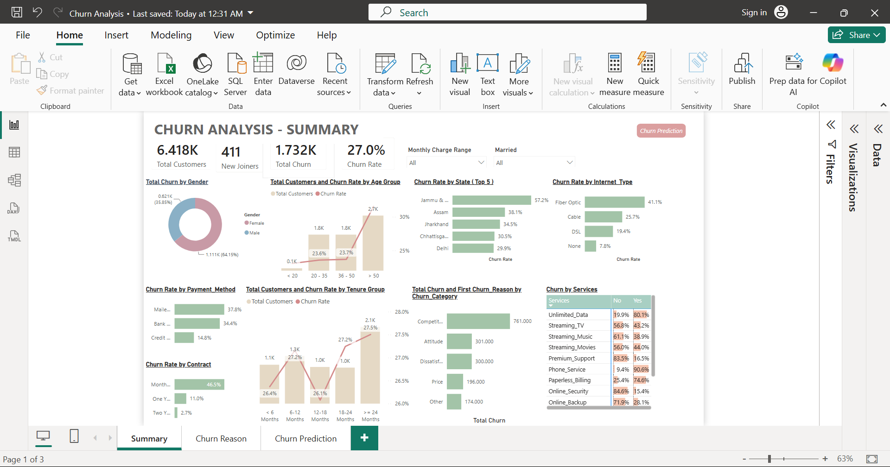

# 📉 Telecom Customer Churn Prediction & Analysis




## Executive Summary
In the telecommunications sector, customer retention is highly cost-effective compared to new customer acquisition. This project outlines an end-to-end data pipeline designed to analyze historical customer data, isolate the root causes of attrition, and deploy a machine learning classification model to predict high-risk churners. The resulting dashboard and predictions enable stakeholders to transition from reactive to proactive retention strategies, potentially saving tens of thousands in monthly recurring revenue.

## Implementation Methodology

### 1. Data Engineering (SQL)
* **Data Ingestion:** Orchestrated the extraction of raw CSV files into a SQL Server staging environment.
* **Data Cleansing & Transformation:** Executed queries to handle missing values, standardize categorical variables, and resolve anomalies. 
* **Production Schema:** Engineered a production-ready schema and established structured views to isolate historical training data from active customer scoring data.

### 2. Machine Learning Pipeline (Python)
* **Algorithm Selection:** Deployed a Random Forest Classifier to capture complex, non-linear relationships across demographic and account-level features.
* **Feature Engineering:** Built a robust preprocessing pipeline utilizing `LabelEncoder`. Implemented defensive programming logic to gracefully handle previously unseen categorical labels in incoming live data.
* **Business Impact (Scoring):** Processed the active customer base through the trained model, successfully identifying **1,270 high-risk accounts**. Assuming an average monthly charge of $65, this model isolates **~$82,500 in monthly at-risk revenue**, allowing for highly targeted retention campaigns.

### 3. Reporting & Analytics (Power BI)
* **Dashboard Development:** Architected an interactive dashboard connected directly to the SQL Server views.
* **Metric Calculation:** Authored custom DAX measures to track overall churn rate, active user volume, and predicted churn counts.
* **Behavioral Mapping:** Visualized cohort behaviors across contract types, payment methods, and service usage to isolate the primary drivers of customer attrition.

## Key Business Insights
* **Contract Vulnerability:** Customers on month-to-month contracts exhibit a substantially higher churn rate compared to those on 1-year or 2-year commitments.
* **Payment Friction:** Higher attrition correlates strongly with manual payment methods (e.g., mailed or electronic checks) versus automated bank withdrawals.
* **Service Gaps:** Accounts lacking supplementary features, specifically 'Online Security' and 'Tech Support', display a significantly higher baseline probability of churning.

## Future Work & Recommendations
* **A/B Testing:** Deploy targeted promotional offers (e.g., a 10% discount to switch to an annual contract) to the 1,270 predicted churners and measure the retention lift against a control group.
* **Feature Importance Deep Dive:** Integrate a SHAP (SHapley Additive exPlanations) summary plot into the Python pipeline for more granular, customer-level explainability.

## Repository Structure
```text
├── data/                       
│   ├── raw_customer_data.csv
│   └── predicted_churners.csv
├── sql/                        
│   ├── 1_create_database.sql
│   ├── 2_data_exploration_distinct.sql
│   ├── 3_data_exploration_nulls.sql
│   ├── 4_remove_nulls.sql
│   └── 5_create_view_for_BI.sql
├── notebooks/                  
│   └── Random_Forest_Churn_Prediction.ipynb
├── dashboard/                  
│   ├── Churn_Analysis_Dashboard.pbix
│   └── Dashboard_Screenshots/
│       ├── 1_Summary_Page.png
│       └── 2_Prediction_Page.png
└── README.md

